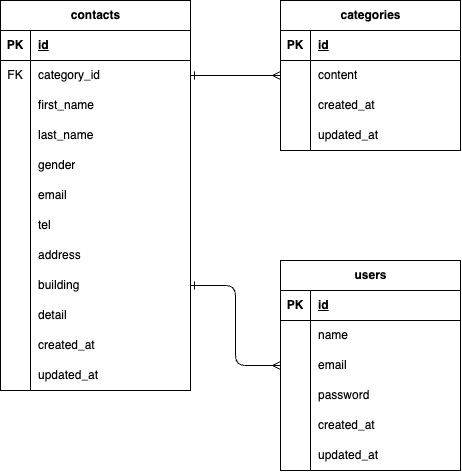

# お問い合わせフォーム (Contact Form)

このアプリケーションは、Laravelで構築された多機能なお問い合わせフォームです。ユーザー登録・ログイン機能、管理者向けの検索・管理機能を備えています。

## 環境構築

### Docker

1. このリポジトリをクローンします。
   ```
   git clone [https://github.com/KaitoS828/Confirmation-test]
   ```
2. プロジェクトディレクトリに移動します。
   ```
   cd contact---form
   ```
3. Dockerコンテナをビルドして起動します。
   ```
   docker-compose up -d --build
   ```

### Laravel

1. PHPコンテナにアクセスします。
   ```
   docker-compose exec php bash
   ```
2. Composerの依存関係をインストールします。
   ```
   composer install
   ```
3. `.env.example` ファイルをコピーして `.env` ファイルを作成します。
   ```
   cp .env.example .env
   ```
4. アプリケーションキーを生成します。
   ```
   php artisan key:generate
   ```
5. データベースのマイグレーションと初期データの投入を実行します。
   ```
   php artisan migrate:fresh --seed
   ```

以上で環境構築は完了です。 `exit` でコンテナから抜けてください。

## 使用技術(実行環境)

- PHP: 8.1
- Laravel: 8.75
- MySQL: 8.0.26
- Nginx: 1.21.1
- Docker

## ER図

`ER.drawio` ファイルを参照、または以下の画像をインポートしてください。




## URL

- 開発環境: [http://localhost/](http://localhost/)
- phpMyAdmin: [http://localhost:8080/](http://localhost:8080/)
